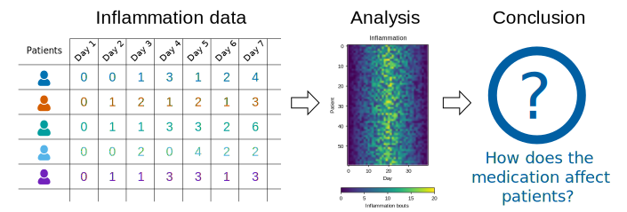

## Welcome to SWD1a: Introduction to Python

This website contains materials from [The Carpentries](https://carpentries.org/), with
some small modifications to tailor it to our needs for *SWD1a: Introduction to Python*
here at the University of Leeds.

Please refer to your course hackpad for additional links, topics, and discussion
points specific to your course.

## The format of this workshop

The best way to learn how to program is to do something useful,
so this introduction to Python is built around a common scientific task:
**data analysis**.

### Scenario: A Miracle Arthritis Inflammation Cure

Our imaginary colleague "Dr. Maverick" has invented a new miracle drug that promises to
cure arthritis inflammation flare-ups after only 3 weeks since initially taking the
medication! Naturally, we wish to see the clinical trial data, and after months of asking
for the data they have finally provided us with a CSV spreadsheet containing the clinical
trial data.

The CSV file contains the number of inflammation flare-ups per day for the 60 patients
in the initial clinical trial, with the trial lasting 40 days. Each row corresponds to a
patient, and each column corresponds to a day in the trial. Once a patient has their first
inflammation flare-up they take the medication and wait a few weeks for it to take effect
and reduce flare-ups.

To see how effective the treatment is we would like to:

1. Calculate the average inflammation per day across all patients.
2. Plot the result to discuss and share with colleagues.

{alt='3-step flowchart shows inflammation data records for patients moving to the Analysis stepwhere a heat map of provided data is generated moving to the Conclusion step that asks thequestion, How does the medication affect patients?'}

### Data Format

The data sets are stored in
[comma-separated values](learners/reference.md#comma-separated-values) (CSV) format:

- each row holds information for a single patient,
- columns represent successive days.

The first three rows of our first file look like this:

```source
0,0,1,3,1,2,4,7,8,3,3,3,10,5,7,4,7,7,12,18,6,13,11,11,7,7,4,6,8,8,4,4,5,7,3,4,2,3,0,0
0,1,2,1,2,1,3,2,2,6,10,11,5,9,4,4,7,16,8,6,18,4,12,5,12,7,11,5,11,3,3,5,4,4,5,5,1,1,0,1
0,1,1,3,3,2,6,2,5,9,5,7,4,5,4,15,5,11,9,10,19,14,12,17,7,12,11,7,4,2,10,5,4,2,2,3,2,2,1,1
```

Each number represents the number of inflammation bouts that a particular patient experienced on a
given day.

For example, value "6" at row 3 column 7 of the data set above means that the third
patient was experiencing inflammation six times on the seventh day of the clinical study.

In order to analyze this data and report to our colleagues, we'll have to learn a little bit
about programming.

::::::::::::::::::::::::::::::::::::::::::  prereq

## Prerequisites

You need to understand the concepts of **files** and **directories** and how to start a Python
interpreter before tackling this lesson. This lesson sometimes references Jupyter
Notebook although you can use any Python interpreter mentioned in the [Setup](learners/setup.md).

The commands in this lesson pertain to any officially supported Python version, currently **Python
3\.8+**.  Newer versions usually have better error printouts, so using newer Python versions is
recommend if possible.


::::::::::::::::::::::::::::::::::::::::::::::::::

### Getting Started

To get started, follow the directions on the [Setup](learners/setup.md) page to open up Google colab.
After the course, you can follow the intructions here to install a Python interpreter locally on your
machine.

# Course notebooks

In addition to the detailed notes here, we also provide template notebooks for you to launch in Google Colab.

## Day 1 notebooks:

- [Introduction](colab.research.google.com/github/ARCTraining/swd1a-notebooks/blob/main/01-intro.ipynb)
- [Lists](colab.research.google.com/github/ARCTraining/swd1a-notebooks/blob/main/04-lists.ipynb)
- [Loops](colab.research.google.com/github/ARCTraining/swd1a-notebooks/blob/main/05-loops.ipynb)
- [Numpy](colab.research.google.com/github/ARCTraining/swd1a-notebooks/blob/main/02-numpy.ipynb)

## How to use these notebooks

Note that links in these notes may be broken, please
see the [course notes here](https://arctraining.github.io/python-novice-inflammation/01-intro.html) for correct links etc.

### Stop! When you see the header "solution"

When you read a challenge asking you to do something, don't read beyond the next header that reads "Solution". Insert a new code cell below the question and attempt to solve it yourself before reading on.

### Remember to apply PRIMM

When you see a piece of code, remember:

1. Before you do anything else, **predict** what the output is going to be.
2. Then **run** it, and compare the output to your prediction.
3. You can begin to **investigate**, especially if your guess is way off - what information can you find in the notes, or online?
4. Once you've tried to understand how the code works, try to **modify** it and make some changes.
5. Then, you're ready to start **making** your own code!

We will mainly be cycling through stages 1 and 2, with some of the later stages coming in as you build more knowledge.


