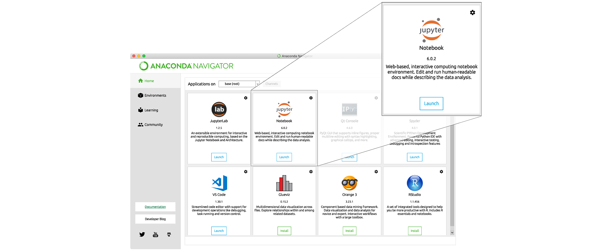
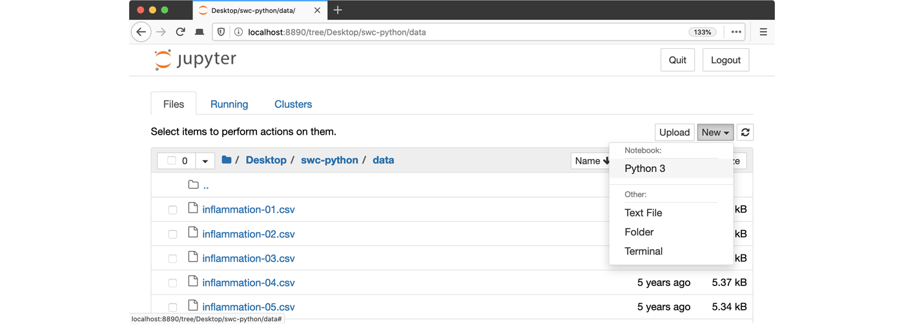

## Overview

This lesson is designed to be run on a personal computer.
All of the software and data used in this lesson are freely available online,
and instructions on how to obtain them are provided below.

## Get Python

In this lesson, we will be using Python 3 with some of its most popular scientific libraries.
We are going to be using [Google Colab](https://colab.google/), a hosted Jupyter Notebook service
that requires no setup to use and provides free access to computing resources,
including GPUs and TPUs.

To get started, you just need to log in with a Google account and either click ["New Notebook"](https://colab.new/),
or launch the relevant template notebook from the list below.

### Course notebooks

In addition to the detailed notes here, we also provide template notebooks for you to launch in Google Colab.

#### Day 1 notebooks:

- [Introduction](https://colab.research.google.com/github/ARCTraining/swd1a-notebooks/blob/main/01-intro.ipynb)
- [Lists](https://colab.research.google.com/github/ARCTraining/swd1a-notebooks/blob/main/04-lists.ipynb)
- [Loops](https://colab.research.google.com/github/ARCTraining/swd1a-notebooks/blob/main/05-loops.ipynb)
- [Numpy](https://colab.research.google.com/github/ARCTraining/swd1a-notebooks/blob/main/02-numpy.ipynb)

#### Day 1 exercise:

- [Day 1 exercise](https://colab.research.google.com/github/ARCTraining/swd1a-notebooks/blob/main/list_loops_exercise.ipynb)


#### How to use these notebooks

Note that links in these notes may be broken, please
refer back to these course notes for glossary terms etc.

#### Stop! When you see the header "solution"

When you read a challenge asking you to do something, don't read beyond the next header that reads "Solution". Insert a new code cell below the question and attempt to solve it yourself before reading on.

#### Remember to apply PRIMM

When you see a piece of code, remember:

1. Before you do anything else, **predict** what the output is going to be.
2. Then **run** it, and compare the output to your prediction.
3. You can begin to **investigate**, especially if your guess is way off - what information can you find in the notes, or online?
4. Once you've tried to understand how the code works, try to **modify** it and make some changes.
5. Then, you're ready to start **making** your own code!

We will mainly be cycling through stages 1 and 2, with some of the later stages coming in as you build more knowledge.

## Obtain lesson materials

There a few different ways of loading in the data.

### 1. Download it directly in Colab

In Colab, you can access the terminal of the remote machine by using `!` in front of Linux
bash commands. This means you can use the Linux command `wget` to download files from the internet.
This snippet is included in the relevant template notebook files linked above.

**Note: the file storage space on the remote machine you are using in Google Colab is not persistent:
the files and folders you upload/save will not still be there when you next log in. Please download
your work if you want to save it.**

#### Download files

```python=
# Download 2 files and store in the swc-python folder
!wget -P swc-python https://swcarpentry.github.io/python-novice-inflammation/data/python-novice-inflammation-data.zip 
!wget -P swc-python https://swcarpentry.github.io/python-novice-inflammation/files/code/python-novice-inflammation-code.zip
```

#### Unzip files

```python=
# Extract .zip files inside the folder swc-python/
!unzip /content/swc-python/python-novice-inflammation-code.zip -d /content/swc-python/
!unzip /content/swc-python/python-novice-inflammation-data.zip -d /content/swc-python/
```

### 2. Manual download

You can download the files and code directly to your machine:

1. Download [python-novice-inflammation-data.zip][zipfile1]
  and [python-novice-inflammation-code.zip][zipfile2].
2. Create a folder called `swc-python` on your Desktop.
3. Move downloaded files to `swc-python`.
4. Unzip the files.

You should see two folders called `data` and `code` in the `swc-python` directory on your
Desktop.

You can then use the files dialogue in the right hand panel of Colab to upload these files.

## After this course: install Python

When you are working on research coding, you will want to use Python from your local
machine. Here are some instructions for you to follow *after* this course, to set
up Python on your machine.

Although one can install a plain-vanilla Python and all required libraries by hand,
we recommend installing [Anaconda][anaconda-website],
a Python distribution that comes with everything we need for the lesson.
Detailed installation instructions for various operating systems can be found
on The Carpentries [template website for workshops][anaconda-instructions]
and in [Anaconda documentation][anaconda-install].

### Launch Python interface

To start working with Python, we need to launch a program that will interpret and execute our
Python commands. Below we list several options. If you don't have a preference, proceed with the
top option in the list that is available on your machine. Otherwise, you may use any interface
you like.

### Option A: Jupyter Notebook

A Jupyter Notebook provides a browser-based interface for working with Python.
If you installed Anaconda, you can launch a notebook in two ways:

::::::::::::::::: spoiler

### Anaconda Navigator

1. Launch Anaconda Navigator.
  It might ask you if you'd like to send anonymized usage information to Anaconda developers:
  {alt='Anaconda Navigator first launch'}
  Make your choice and click "Ok, and don't show again" button.
2. Find the "Notebook" tab and click on the "Launch" button:
  {alt='Anaconda Navigator Notebook launch'}
  Anaconda will open a new browser window or tab with a Notebook Dashboard showing you the
  contents of your Home (or User) folder.
3. Navigate to the `data` directory by clicking on the directory names leading to it:
  `Desktop`, `swc-python`, then `data`:
  {alt='Anaconda Navigator Notebook directory'}
4. Launch the notebook by clicking on the "New" button and then selecting "Python 3":
  {alt='Anaconda Navigator Notebook directory'}

:::::::::::::::::::::::::


::::::::::::::::: spoiler

### Command line (Terminal)

1\. Navigate to the `data` directory:

::::::::::::::::: spoiler

### Unix shell

If you're using a Unix shell application, such as Terminal app in macOS, Console or Terminal
in Linux, or [Git Bash][gitbash] on Windows, execute the following command:

```bash
cd ~/Desktop/swc-python/data
```

:::::::::::::::::::::::::

::::::::::::::::: spoiler

### Command Prompt (Windows)

On Windows, you can use its native Command Prompt program.  The easiest way to start it up is
pressing <kbd>Windows Logo Key</kbd>\+<kbd>R</kbd>, entering `cmd`, and hitting
<kbd>Return</kbd>. In the Command Prompt, use the following command to navigate to
the `data` folder:

```source
cd /D %userprofile%\Desktop\swc-python\data
```

:::::::::::::::::::::::::

2\. Start Jupyter server

::::::::::::::::: spoiler

### Unix shell

```bash
jupyter notebook
```

:::::::::::::::::::::::::


::::::::::::::::: spoiler

### Command Prompt (Windows)

```source
python -m notebook
```

:::::::::::::::::::::::::

3\. Launch the notebook by clicking on the "New" button on the right and selecting "Python 3"
from the drop-down menu:
{alt='Anaconda Navigator Notebook directory'}

:::::::::::::::::::::::::

  <!-- vertical spacer -->

### Option B: IPython interpreter

IPython is an alternative solution situated somewhere in between the plain-vanilla Python
interpreter and Jupyter Notebook. It provides an interactive command-line based interpreter with
various convenience features and commands.  You should have IPython on your system if you installed
[Anaconda][anaconda-instructions].

To start using IPython, execute:

```source
ipython
```

  <!-- vertical spacer -->

### Option C: plain-vanilla Python interpreter

To launch a plain-vanilla Python interpreter, execute:

```source
python
```

If you are using [Git Bash on Windows][gitbash], you have to call Python *via* `winpty`:

```source
winpty python
```

[anaconda-website]: https://www.anaconda.com/
[anaconda-instructions]: https://carpentries.github.io/workshop-template/install_instructions/#python
[anaconda-install]: https://docs.anaconda.com/anaconda/install
[zipfile1]: data/python-novice-inflammation-data.zip
[zipfile2]: ../episodes/files/code/python-novice-inflammation-code.zip
[gitbash]: https://gitforwindows.org


